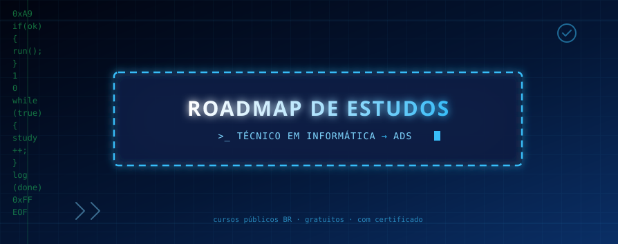
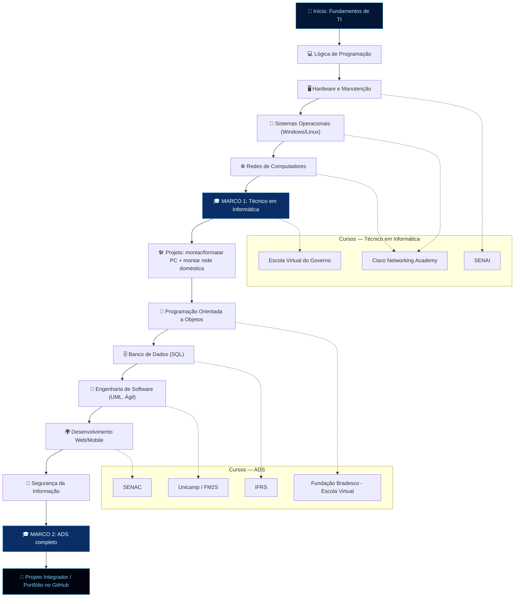

  

  
  
  

# 📚 Estudos — Técnico em Informática → ADS

> `PS C:\Users\dev> echo "do zero ao deploy, documentando tudo no git."`

Repositório onde vou ajudar e registrar minha trilha de estudos, que fiz do zero até Análise e Desenvolvimento de Sistemas (ADS) e alguns cursos de Informática, usando **cursos públicos e governamentais brasileiros com certificado**, e projetos práticos para aprender "na raça". Desde já agradeço por visualizar minha commit.

 

---

## 🖥️ Vibe do repositório

  
  
  

<i>Terminal cromático, café forte e commit todo dia. ⚡</i>

---

## 🧭 Como usar este repositório

- Cada pasta do projeto corresponde a uma etapa da trilha abaixo.
- Os cursos linkados são **gratuitos e emitem certificado**. Carga horária, vagas e prazos mudam com frequência — confirme sempre no site oficial antes de se inscrever.
- A ordem sugerida é **Técnico em Informática primeiro, ADS depois** — a base de hardware, SO e redes facilita muito o resto.

---

## 🗺️ Fluxo da trilha

---

## 📁 Trilha por etapas (clique para abrir cada aba)

<b>🟦 Etapa 1 — Técnico em Informática (base)</b>

 

| Tema | Curso gratuito com certificado | Link |
|---|---|---|
| Fundamentos de TI, hardware, manutenção | SENAI — cursos gratuitos de TI | https://www.senai.br |
| Redes, Linux, Cibersegurança | Cisco Networking Academy (NDG Linux, IT Essentials, CCNA Introdução às Redes) | https://www.netacad.com |
| Informática geral, lógica, pacote Office | Escola Virtual do Governo (EVG) | https://www.escolavirtual.gov.br |
| TI e suporte técnico | SENAC — cursos online gratuitos | https://www.senac.br |

**✅ Checklist de cursos**
- [ ] SENAI — curso de hardware/manutenção concluído
- [ ] Cisco Networking Academy — NDG Linux Essentials
- [ ] Cisco Networking Academy — CCNA Introdução às Redes
- [ ] Escola Virtual do Governo — informática básica

**🛠️ Checklist de projetos práticos**
- [ ] Montar/formatar um PC e documentar o passo a passo com fotos
- [ ] Instalar Linux (dual boot ou VM) + caderno de comandos
- [ ] Montar/simular uma rede doméstica (Packet Tracer) com diagrama
- [ ] Simular um sistema de chamados de helpdesk

<b>🟩 Etapa 2 — ADS (Análise e Desenvolvimento de Sistemas)</b>

 

| Tema | Curso gratuito com certificado | Link |
|---|---|---|
| Lógica e programação (Python, Java, C) | Fundação Bradesco — Escola Virtual | https://www.ev.org.br |
| Banco de dados e SQL | IFRS — cursos EAD gratuitos | https://ead.ifrs.edu.br |
| Programação, dados, trilhas técnicas | SENAC | https://www.senac.br |
| Gestão de projetos, Ágil, Ciência de Dados | Unicamp / FM2S | (buscar "cursos gratuitos Unicamp FM2S") |
| Idiomas (inglês técnico) | MEC — cursos de idiomas online | (buscar "MEC cursos de idiomas gratuitos") |
| Diversas trilhas de programação em PT-BR | DIO — Digital Innovation One | https://www.dio.me |

**✅ Checklist de cursos**
- [ ] Fundação Bradesco — lógica/programação
- [ ] IFRS — banco de dados
- [ ] SENAC — trilha técnica
- [ ] Unicamp/FM2S — gestão de projetos
- [ ] MEC — inglês técnico

**🚀 Checklist de projetos práticos**
- [ ] **Lógica:** jogo da forca ou calculadora no terminal
- [ ] **POO:** sistema de biblioteca (cadastro + empréstimos)
- [ ] **Banco de dados:** CRUD completo em SQL
- [ ] **Engenharia de software:** modelagem UML de um sistema pequeno
- [ ] **Web:** landing page responsiva → evoluir para API REST
- [ ] **Segurança:** login com senha criptografada (hash)
- [ ] **Projeto integrador final:** sistema completo publicado no GitHub com README e demo

<b>🎬 Canais complementares (sem certificado, mas ótimos para reforçar)</b>

 

- [Curso em Vídeo](https://www.youtube.com/@CursoemVideo) — base de lógica, PHP, Java, banco de dados.
- [Fabio Akita (Akitando)](https://www.youtube.com/@Akitando) — fundamentos profundos de computação e carreira.
- [Filipe Deschamps](https://www.youtube.com/@FilipeDeschamps) — programação web e carreira.
- [Código Fonte TV](https://www.youtube.com/@codigofontetv) — conceitos e mercado de trabalho.

---

## ✅ Progresso geral

> Marque `[x]` e dê commit pra registrar seu avanço — é a forma de "checkbox interativo" que o GitHub permite num README.

- [ ] Técnico em Informática — fundamentos
- [ ] Técnico em Informática — projeto prático
- [ ] ADS — lógica e POO
- [ ] ADS — banco de dados
- [ ] ADS — web/mobile
- [ ] Projeto integrador final

---

  

<i>Feito com 💻, café e muita documentação no GitHub.</i>

© 2026 Thiago Oliveira da Silva. Todos os direitos reservados.

